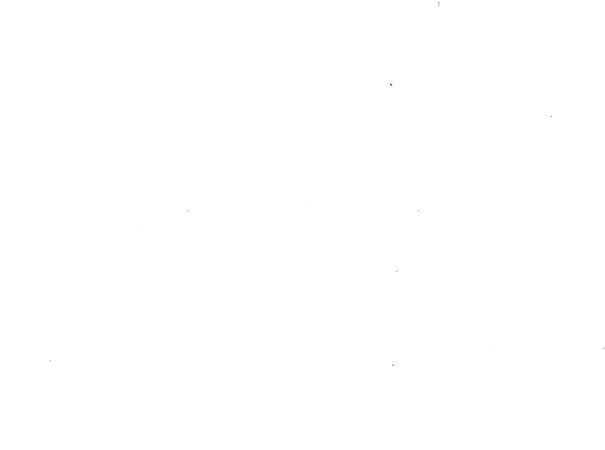
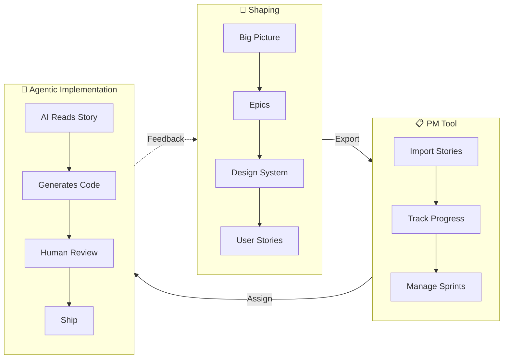

# Nova Process - Starter Template

This repository serves as a template for an active workspace for developing product shape and requirements as part of [LaunchPad Lab's](https://launchpadlab.com) **Nova process** for AI-first software delivery. This workspace is ideal for shaping new projects or large new groups of functionality where broader client and project level context is necessary.

## What is Nova?

Nova is LaunchPad Lab's structured approach to product development that bridges the gap between abstract ideas and actionable requirements through to implementation.



This part of the process guides teams through sequential phases:

1. **Big Picture** — Define strategic vision, goals, and product requirements
2. **Epics** — Group related features into major deliverable chunks
3. **Design System** — Establish visual language, UI components, and design standards
4. **User Stories** — Break down epics into specific user needs with acceptance criteria

## Why This Structure?

This repository organizes product shape into a **hierarchical file structure** rather than a single monolithic document. This approach offers several benefits:

- **Easier navigation** — Jump directly to specific epics, user stories, or design components without scrolling through hundreds of pages
- **Focused reviews** — Stakeholders can review individual artifacts (a single user story, one epic) without context-switching through unrelated content
- **Parallel collaboration** — Team members can work on different epics or stories simultaneously without merge conflicts
- **Clear traceability** — The folder hierarchy (PRD → Epics → User Stories) mirrors the logical breakdown of requirements, making dependencies visible at a glance
- **Incremental refinement** — Update a single file when requirements change rather than editing a massive document
- **AI-friendly context** — AI assistants can read specific files relevant to the current focus, improving accuracy and reducing noise

## Repository Structure

```
project-root/
├── README.md                 # This file
├── nova.png                  # Nova logo
├── shape/                    # Product documentation (no code)
│   ├── 1_big-picture/        # PRD, flowcharts, strategic vision
│   ├── 2_epics/              # Epic definitions and scope
│   ├── 3_design-system/      # UI/UX standards and components
│   ├── 4_user-stories/       # User stories organized by epic
│   ├── context/              # Source documents and reference materials
│   └── .cursor/rules/        # Cursor AI rules for generating artifacts
│       ├── create-epic/
│       ├── create-prd/
│       ├── create-user-story/
│       └── export-to-asana/
├── scripts/                  # Utility scripts
│   └── export-to-asana.sh    # Export epics/stories to Asana CSV
├── exports/                  # Generated export files (gitignored)
└── .vscode/                  # VS Code / Cursor settings
```

### The Context Folder

The `shape/context/` folder holds your provided source documents and reference materials that inform the shaping process. Add files like these **before** generating your PRD:

- **Statements of Work (SOW)** — Contractual scope and deliverables
- **Product Briefs** — Initial product vision and high-level requirements
- **Discovery Notes** — Stakeholder interviews and research findings
- **Competitive Analysis** — Market research and competitor features
- **Technical Constraints** — Existing systems, integrations, or limitations
- **Brand Guidelines** — Visual identity and design constraints
- **External Tool Export** - Asana, Notion, etc. to inject context for existing projects

AI assistants will reference these documents when generating artifacts, ensuring alignment with business agreements and stakeholder expectations.

## Getting Started

1. **Download this repository** and open the zip and rename it to your project name (optional: **fork this repository** if you are comfortable with `git` commands)
2. **Open the project folder in Cursor** to take advantage of the AI rules and contextual guidance
3. **Add source documents** to `shape/context/` (SOW, product briefs, discovery notes)
4. Start in `shape/1_big-picture/` to create your PRD
5. Create epics in `shape/2_epics/` based on PRD features
6. Progress through design system and user stories sequentially
7. Use the example files in each directory as templates

## Sample Prompts

Use these example prompts to generate each type of artifact with your AI assistant.

### PRD (Product Requirements Document)

```
Create a PRD based on the product brief in shape/context/. The app should help 
users log workouts, track nutrition, and connect with personal trainers. 
Reference the SOW for scope boundaries and timeline constraints.
```

```
I need a PRD for an internal employee onboarding portal. Review the discovery 
notes in shape/context/ for stakeholder requirements. The SOW defines Phase 1 
as document signing and training modules, with equipment requests in Phase 2.
```

### Flowchart

```
Create a page flow diagram for the user authentication journey including 
login, signup, password reset, and email verification paths.
```

```
Generate a flowchart showing the e-commerce checkout process from cart 
review through payment to order confirmation, including guest checkout 
and account creation options.
```

### Epic

```
Create an epic for the Authentication feature from the PRD. Review the SOW 
in shape/context/ to identify all authentication-related requirements across 
portals. Include user stories for login, registration, password reset, and 
session management.
```

```
Generate an epic for the Patient Portal Dashboard feature based on the PRD. 
Cross-reference the product brief in shape/context/ for dashboard priorities 
and the SOW for Phase 1 scope boundaries.
```

### User Story

```
Create a user story for password reset functionality within Authentication epic. Users should be able 
to request a reset link via email, set a new password, and be automatically 
logged in after resetting.
```

```
Write a user story for a patient viewing their upcoming appointments. 
Include scenarios for when they have appointments scheduled, when they 
have none, and when they need to reschedule.
```

## Key Principles

- **Shape First** — Define the product thoroughly before delivery begins
- **Sequential Phases** — Complete each phase before advancing
- **Traceability** — Every user story traces back to the PRD
- **Iterative Refinement** — Expect and embrace refinements as you learn
- **User Value Focus** — Keep user needs at the center of every decision

## After Shaping

Once the shaping process is substantially complete:

1. **Export to Project Management** — Transfer user stories into your project management tool (e.g., [Asana](#exporting-to-asana), Jira, Linear) for assignment and tracking during implementation
2. **Track Changes in PM Tool** — As requirements evolve during delivery, capture updates directly in the project management tool
3. **Periodic Documentation Sync** — At regular intervals, revisit the higher-level product documentation (`shape/1_big-picture/`, `shape/2_epics/`, `shape/4_user-stories/`) to align with any significant changes that emerged during implementation

This approach keeps the shape documentation as a strategic reference while the project management tool handles day-to-day execution.

### Exporting to Asana

A bash script is included to export epics and user stories to an Asana-compatible CSV format.

**Run the export in agent chat:**

```
Export epics and user stories to Asana CSV
```

Or run manually in terminal:

```bash
./scripts/export-to-asana.sh
```

This generates `exports/asana-import.csv` with the following structure:

| Column | Epic | User Story |
|--------|------|------------|
| Name | `[EPIC_ID] Epic Title` | `[STORY_ID] Story Title` |
| Description | Epic description | User story statement + acceptance criteria |
| Type | `Milestone` | *(empty)* |
| Parent Task | *(empty)* | Exact epic name (e.g., `[ATH] User Authentication`) |

**File naming convention for automatic parent linking:**

For user stories to automatically link to their parent epic, follow this naming pattern:

- **Epic file:** `shape/2_epics/ath_user_authentication.md` with `**Epic ID:** ATH` in the content
- **Story files:** `shape/4_user-stories/ath_01_user_registration.md`, `ath_02_user_login.md`, etc.

The script extracts the epic prefix from the story filename (e.g., `ath_01_...` → `ATH`) and matches it to the epic with that ID.

**Import to Asana:**

1. Open your Asana project
2. Click the dropdown arrow next to the project name
3. Select **Import** → **CSV**
4. Upload `exports/asana-import.csv`
5. Map columns: Name, Description, Type, Parent Task

> **Note:** The `exports/` directory and all `.csv` files are gitignored to keep generated files out of version control.

If comfortable with a more advanced setup, the [Asana MCP](https://developers.asana.com/docs/using-asanas-mcp-server) can be used to sync content.

## Contact

For questions about the Nova process or this repository structure, contact LaunchPad Lab at [launchpadlab.com](https://launchpadlab.com).
